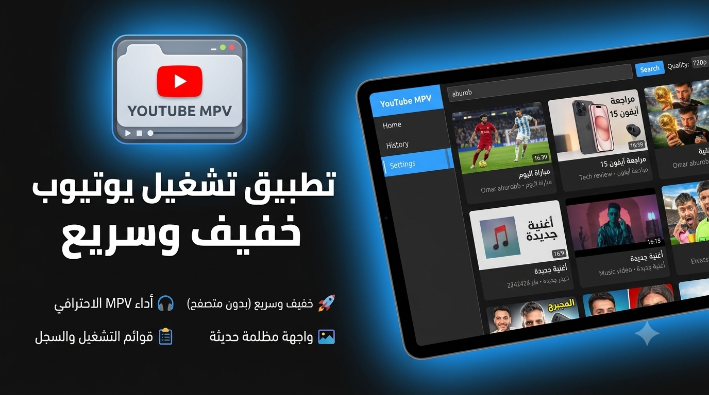

<div align="center">
  <h1>🎬 YouTube MPV Player Light</h1>
  <p><strong>A lightweight, privacy-focused desktop YouTube player</strong></p>
  <p>Stream YouTube videos directly — no browser, LOW-END use RAM , no ads, no API keys, no account required.</p>
<p align="center">
  
</p>
  <br>
</div>

---

## ✨ Features

- **🔍 YouTube Search** — Full-text search powered by yt-dlp with infinite scroll pagination
- **▶️ Video Playback** — Streams via MPV with quality selection (360p/480p/720p/1080p/best)
- **📜 Watch History** — Auto-saves watched videos (500 cap, dedup, async persistence)
- **❤️ Likes & Watch Later** — Save and organize videos locally
- **📂 Playlists** — Create, rename, delete, and manage custom playlists (with built-in Watch Later)
- **👤 Multi-Profile** — Separate profiles with independent settings, history, and playlists
- **🎨 Dark Theme** — Modern dark UI with theme management system
- **🖼️ Thumbnail Caching** — LRU memory + disk cache with async loading
- **📋 Paste URL** — Direct playback from any YouTube URL
- **⚡ Performance** — Debounced async saves, O(1) video lookups, smooth scrolling
- **🔌 No API Keys** — Fully local using yt-dlp (no Google Cloud, no OAuth)

---

## 🖼️ Screenshots

> *Coming soon — run the app to see it in action!*

---

## 🚀 Quick Start

### Prerequisites

- **Python 3.14+**
- **mpv.exe** ([Download](https://mpv.io/)) — Place in project root
- **yt-dlp.exe** ([Download](https://github.com/yt-dlp/yt-dlp)) — Place in project root

### Installation

```powershell
# Clone the repository
git clone https://github.com/raoufLR/YouTube-MPV-Player.git
cd YouTubeMpvPlayer

# Install Python dependencies
pip install -r requirements.txt

# Run the application
python main.py
```

> **First run** creates `User/` and `Cache/` directories automatically.

### Build a Portable Executable

```powershell
pip install pyinstaller
python build.py
# Output: dist\youtube_video_player.exe (~84 MB)
```

---

## 🏗️ Architecture

```
main.py → Application (composition root)
           ├── EventBus (thread-safe pub/sub)
           ├── ServiceContainer (DI with 12 services)
           └── MainWindow (PyQt6 UI)
               ├── SidebarWidget (navigation)
               ├── HeaderWidget (search + quality selector)
               └── Pages
                   ├── SearchPage     — Infinite-scroll search results
                   ├── HistoryPage    — Watch history with context menus
                   ├── PlaylistsPage  — Playlist CRUD with split panel
                   └── SettingsPage   — Preferences with auto-save
```

### Services

| Service | Responsibility |
|---------|---------------|
| **LoggingService** | Centralized logging |
| **UserManagerService** | Multi-profile management |
| **SettingsService** | User preferences (quality, theme, volume, speed, etc.) |
| **PlayerService** | MPV subprocess control |
| **StreamResolverService** | yt-dlp stream URL resolution (background thread) |
| **SearchService** | YouTube search via yt-dlp |
| **ThumbnailCacheService** | LRU memory + disk thumbnail cache |
| **UserProfileService** | Profile & avatar management |
| **HistoryService** | Watch history (event-driven, async flush) |
| **LikesService** | Liked videos |
| **PlaylistService** | Playlists CRUD + Watch Later |
| **RecommendationService** | Video recommendations |

### Event Flow

```
User Action → Qt Signal → MainWindow → Service → EventBus → Subscribers
```

The app uses an **event-driven architecture** with 24+ event types to decouple components. All UI updates are marshalled to the main thread via Qt signals.

---

## 📁 Project Structure

```
YouTubeMpvPlayer/
├── main.py                     # Application entry point
├── entry.py                    # Alternate entry (ensures PYTHONPATH)
├── player.py                   # MPV subprocess wrapper (IPC via named pipe)
├── youtube_api.py              # yt-dlp wrapper (search + stream extraction)
├── build.py                    # Canonical build script
├── youtube_video_player.spec   # PyInstaller spec file
├── requirements.txt            # Python dependencies
│
├── app/                        # Application bootstrap & DI
│   ├── application.py          # Composition root
│   └── service_container.py    # 12-service DI registry
│
├── core/                       # Event system
│   ├── event_bus.py            # Thread-safe pub/sub with weak refs
│   └── events.py               # 24+ event dataclass types
│
├── services/                   # Business logic (12 services)
│
├── models/                     # Data models (4 dataclasses)
│   ├── playlist.py
│   ├── profile.py
│   ├── user_profile.py
│   └── user_settings.py
│
├── ui/                         # PyQt6 UI components
│   ├── main_window.py          # Main window with page stack
│   ├── sidebar_widget.py       # Navigation sidebar
│   ├── header_widget.py        # Search bar + quality selector
│   ├── now_playing_bar.py      # Mini player controls
│   ├── avatar_widget.py        # Profile avatar
│   ├── event_dispatcher.py     # Qt signal bridge
│   ├── icons.py                # SVG icon collection
│   ├── status_bar_widget.py    # Status feedback
│   ├── themes/                 # ThemeManager system
│   ├── pages/                  # Page widgets
│   └── components/             # Reusable widgets (skeleton, video card)
│
├── tests/                      # Test suite (65+ tests)
├── User/                       # User data (profiles, settings, history)
├── Cache/thumbnails/           # Thumbnail disk cache
├── mpv.exe / yt-dlp.exe       # Local binaries
│
├── _archive/                   # Previous build scripts (archived)
├── BUILD.md                    # Build instructions
├── PROJECT_MEMORY.md           # Detailed architecture docs
└── README.md                   # This file
```

---

## 🧪 Testing

```powershell
# Run all tests
pytest tests/ -v

# Run with coverage
pytest tests/ --cov=. --cov-report=term
```

The test suite covers all 12 services with 65+ tests using mocked yt-dlp/mpv subprocesses.

---

## 🛠️ Technologies

| Tech | Version | Purpose |
|------|---------|---------|
| [Python](https://www.python.org/) | 3.14 | Main language |
| [PyQt6](https://www.riverbankcomputing.com/software/pyqt/) | 6.11+ | GUI framework |
| [MPV](https://mpv.io/) | 0.41.0 | Video playback engine |
| [yt-dlp](https://github.com/yt-dlp/yt-dlp) | 2026.06.09 | YouTube search + streaming |
| [PyInstaller](https://pyinstaller.org/) | 6.21 | Executable packaging |
| [pytest](https://pytest.org/) | — | Testing framework |
| [requests](https://requests.readthedocs.io/) | — | Thumbnail HTTP downloads |

---

## ⚡ Performance

| Benchmark | Before | After | Reduction |
|-----------|--------|-------|-----------|
| 100 SettingsService.set() | 138.4 ms | 1.75 ms | **98.7%** |
| 10,000 EventBus publish | 3693 ms | 15.9 ms | **99.6%** |
| 100 `_update_item_display` | 18.9 ms | 0.61 ms | **96.8%** |

Optimizations include: debounced async saves, O(1) video lookup dict, item text cache, uniform item sizes, HTTP session pooling, batch thumbnail processing, and module-level constants.

---

## 🤝 Contributing

Contributions are welcome! Here's how to get started:

1. Fork the repository
2. Create a feature branch (`git checkout -b feature/amazing-feature`)
3. Commit your changes (`git commit -m 'Add amazing feature'`)
4. Push to the branch (`git push origin feature/amazing-feature`)
5. Open a Pull Request

### Development Priorities

See [PROJECT_MEMORY.md](PROJECT_MEMORY.md) for the full TODO list. Key areas:

- EventBus thread safety (Qt calls from background threads)
- Structured logging (replace print statements)
- Search result caching
- Keyboard shortcuts
- Test coverage expansion

---

## 📄 License

This project is for personal and educational use. It uses:

- **[MPV](https://mpv.io/)** — GPLv2
- **[yt-dlp](https://github.com/yt-dlp/yt-dlp)** — Unlicense
- **[PyQt6](https://www.riverbankcomputing.com/software/pyqt/)** — GPLv3

---

## 🙏 Acknowledgements

- [yt-dlp](https://github.com/yt-dlp/yt-dlp) — YouTube streaming without API keys
- [MPV](https://mpv.io/) — The best video player
- [PyQt6](https://www.riverbankcomputing.com/software/pyqt/) — Python Qt bindings
- [PyInstaller](https://pyinstaller.org/) — Cross-platform executable packaging

---

<div align="center">
  <sub>Built with ❤️ for privacy-conscious YouTube viewers</sub>
</div>
